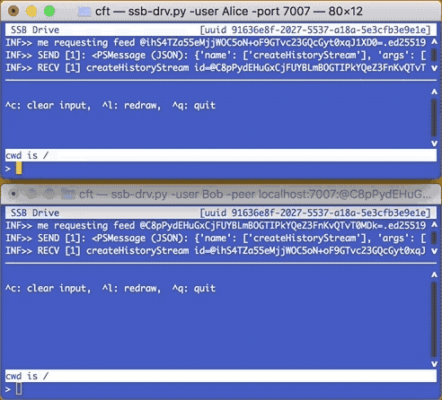

# SSB Drive

This is a proof of concept for a **decentralized file system for Secure
Scuttlebutt** (see [SSB](https://www.scuttlebutt.nz/)). It includes a
partial but interoperable implementation of the SSB peer protocol written
in Python.

With _SBB Drive_ you can create as many file systems ("drives") as you
like, share and organize files with your friends without requiring a
central repository or server. When you work on your files while
offline, the _SSB Drive_ file system will merge automatically with the
rest of the world once you rejoin the grid. Name conflicts are handled
with "Observed Removed Sets" (OR-Sets) from CRDT.

Main usage:
```txt
$ ./ssb-drive.py [-u USERNAME] [-l] [-peer ip:port:id] [UUID]
```
where UUID identifies the drive to work on. Use `-l` to list all
available drives. The `-peer` option selects a specific SSB pub (peer
node); the default behavior is to connect to the locally running SSB
program at port 8008 (e.g. patchwork or sbot).

## Demo

_SSB Drive_ behaves like a classic FTP client except that you don't have
to connect to a server. The following demo shows the terminal-based user
interface of this PoC.



What can be seen in the 30 second animated GIF:

```txt
Alice:  help                  // list available commands
Alice:  ls -l                 // show dir content
Bob:    ls -l                 // Bob sees same content
Bob:    put b.txt             // Bob uploads a file
Alice:  ls -l                 // Alice finds it in her directory
Alice:  cat b.txt             //  and views it
Alice:  put x.txt first.txt   // Alice races to upload first
Bob:    put y.txt first.txt   // Bob races to upload first
Bob:    ls -l                 // surprise: no race condition, but two files
Bob:    tree                  // just another view
Bob:    ls -li                // UNIX -i option: show inode (cypherlink in our case)
                              // i.e., the two files differ, can be removed individually
```

## Pragmatics

Without UUID argument, the app first scans your SSB log and uses the
most recent "root entry" it can find as the work drive -- beware that
this drive could have been created by a friend.  If you know the drive
that you want to use (e.g. if you created several drives and/or want
to be sure to work on a specific one), you should pass that drive's
UUID as an argument.

You can request the creation of a new drive with the `-n` option and list
all available drives with `-l`.

Because SSB is based on append-only logs, all changes ever made to a
drive are preserved for as long as the log or copies of it exist.
If one of your friends deletes a file from a drive that you shared,
the file is still there and can be recovered: _SSB Drive_ is "time
machine-ready" in the sense that all information is available, just
that this PoC does not yet implement a method to browse a drive's
history (and a method to resurrect old entries).

Have fun and handle your friends' SSB drives with respect!

cft, Aug 2018

---

## Example CLI sessions

The full signature of the _SSB Drive_ app is:
```txt
$ ./ssb-drive.py [options] [UUID]
where options are:
  -h, --help        show this help message and exit
  -del              delete the given drive
  -list             list all active drives
  -new              create new drive
  -peer IP:PORT:ID  remote's ip:port:id (default is localhost:8008:default_id
  -port PORT        local port (i.e. become a server)
  -tty              run in line mode (instead of fullscreen terminal)
  -user USERNAME    username (default is ~/.ssb user, or ~/.ssb/user.USERNAME)
  -udel             undelete the given drive
UUID                ssb-drive's uuid (default is youngest drive)
```

### Experimenting with SSB Drive and doing local development

In order to perform local experiments with the SSB Drive Protocol, it
is possible **and advised** to run with local SSB users rather than your
own ID. To this end, for each user USERNAME, we keep a subdirectory with
the following format:
```txt
~/.ssb/user.USERNAME
```
and populate it with the standard SSB data. The _SSB Drive_ software
offers an easy way to do it directly as follows:
```txt
$ ./ssb/local/config.py -list
default user:
  @AiBJDta+4boyh2USNGwIagH/wKjeruTcDX2Aj1r/haM=.ed25519
local users:
  @C8pPydEHuGxCjFUYBLmBOGTIPkYQeZ3FnKvQTvT0MDk=.ed25519  Alice
  @ihS4TZa55eMjjWOC5oN+oF9GTvc23GQcGyt0xqJ1XD0=.ed25519  Bob
  @dQZc5zeLorxwhzDOHn79sSnrOsWrapmVX/LtmyVuJb4=.ed25519  Carole

$ ./ssb/local/config.py -new Dan
** new user Dan (@m1SFdExhNI5k8hN3FVQpC2ZuzH8C0dcy9JyO9Xbp0lg=.ed25519)
```
Consider to also create a `friends.json` file in the respective
`flume` subdirectories and let the local users follow each other.

Now you are ready to let two ssb-drive client instances connect as peers
(each running in its own terminal window):

```txt
$ ./ssb-drive.py -user Alice -new
** new drive created, uuid=9dfc8124-6a6b-5730-9c04-5eed67ac770e

$ ./ssb-drive.py -user Alice -port 7007                # in one terminal
$ ./ssb-drive.py -user Bob localhost:7007:ID_OF_ALICE  # in another terminal
```

It is also possible to run the _SSB Drive_ app in line mode by
selecting the `-tty` option. Note however that this mode does not
yet support peer connections i.e., you will work on the given
user's log __as if offline__:
```txt
$ ./ssb-drive.py -user Alice -tty
Secure Scuttlebutt Drive client (v2018-08-21).  Type ? for help.
running in unencrypted mode

drv=9dfc8124-6a6b-5730-9c04-5eed67ac770e (2018-08-22 21:44:21)
cwd=/
ssb_drv> help

Documented commands (type help <topic>):
========================================
cat  cd  exit  get  help  ls  mkdir  put  pwd  rm  rmdir  stat  sync  tree

ssb_drv> tree
.
'-- dir1/
    |-- README.md
    '-- dir2/
ssb_drv> exit
```

---

## Technical Details

### The "SSB Drive Protocol" (SDP)

to be written

### Todo

* "encrypted SSB Drive": adapt the tangles and let them run in the private log
* implement a time machine (browse history, enable resurrecting files)
* think about mounting other drives into a drive's name tree
* run -tty mode with asyncio and serve the peer protocol in the background

----
