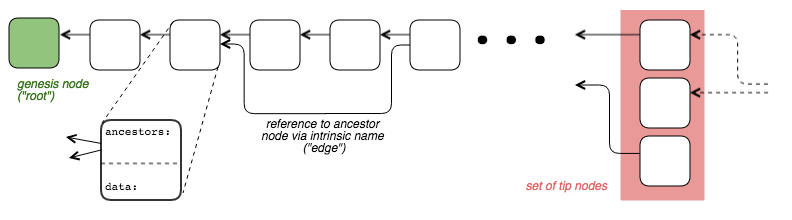
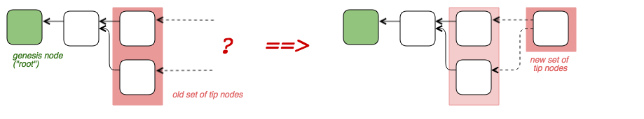
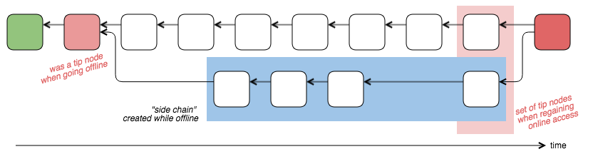
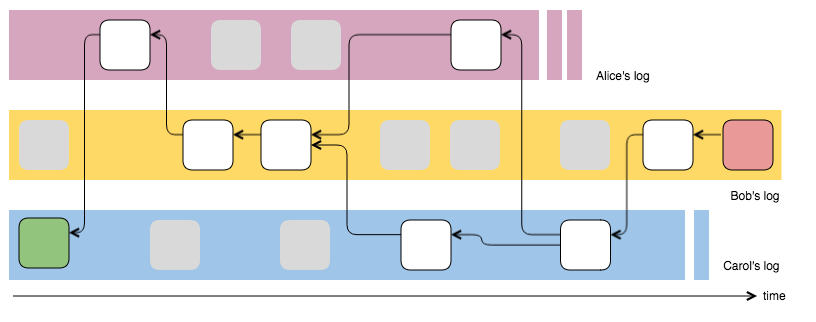
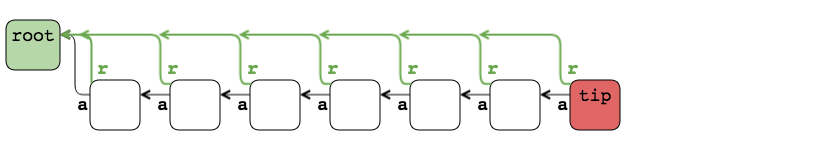
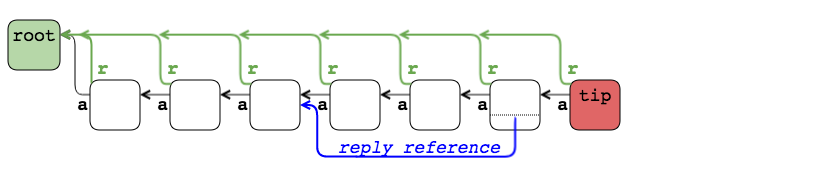
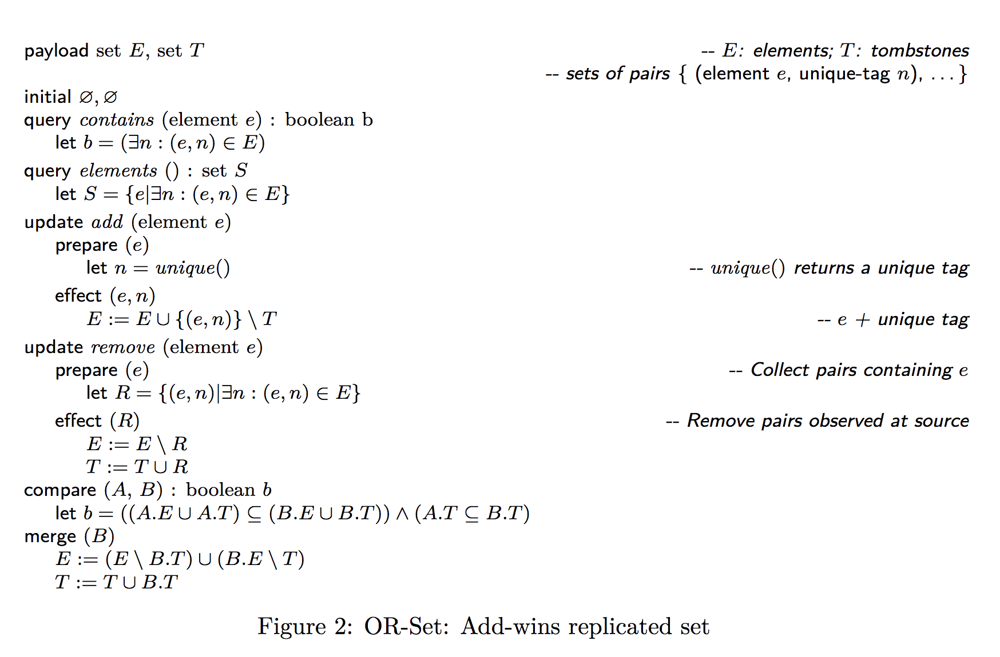

# The Tangle data structure and its use in _SSB Drive_

(incomplete draft 2018-09-04)

This documents introduces the tangle concept, its implementation for
Secure Scuttlebutt and how the _SSB Drive_ file system uses tangles to
represent drives and directories. The Python code for SSB tangles as
well as for the _SSB Drive_ application can be found
[here]([https://github.com/cn-uofbasel/ssbdrv).

Note (especially if you are a reader with a background in
[IOTA](https://www.iota.org/)'s tangle) that the tangle concept
discussed in this paper is not about a cryptocurreny and how its
algorithms can defend it against attackers. Instead, this paper is
about "cooperative tangles" which are operated among friends which have
the technical means to shut out attackers, as we discuss in the
"conformance rules" section.


---
## 1. Tangles

A tangle is an append-only directed acylic graph (DAG) with
special rules for naming old nodes and for appending new ones.

A __node__ of a tangle is a data record which has a __name__; this
name is computed by hashing the binary representation of the
record. Each data record has a special __ancestors field__
consisting of a set of names referring to other nodes of the
tangle. These names in the ancestors field are the graph's __edges__.



The tangle has a dynamic set of nodes called __tips__ which contains
the newest nodes that were added to the tangle. Tips can be seen as
the "frontier of growth" i.e. the set of nodes to which future nodes
will refer to. Tip nodes do not automatically become non-tip
nodes. Instead, their status depends on future nodes referring to them
and "approving" that they become part of the main tangle. Several
conformance rules must be observed for a node to be approved, as we
will discuss later.

### 1.1 Tangles as "discussion threads"

Tangles offer a simple way to share information among SSB peers with
minimal coordination effort. Think about a discussion thread in social
media: The idea is that all parties participating in a discussion
should append their contributions to "the end of the discussion
thread". Ideally, this forms a single chain of references from the
latest entry down to the "genesis node" which marks the discussion
start. This is easy to implement with a central server. But how should
that single thread emerge from fully decentralized operations (and
without installing a heavyweight blockchain)?



If two parties extend a discussion thread concurrently, the question
arises of which of the two extensions is the valid one, or which came
first. With tangles, the answer is _to not decide_ but to record this
event: the next tangle extension will reference both of these thread's
tips and, hopefully, bring the forking thread back to a single-tipped
thread. There is a danger that several parties observe a fork event
and by attempting to heal it produce another fork: But with careful
(and randomized) timing it is possible to reduce the chances of
repeated fork healing.

In case a contributor to a discussion thread is offline for some time,
that party will extend the discussion locally and graft its extension
chain to the most recent node at the time of going offline. When coming
back online, the absent party will now see that it created a "side
chain", with the real thread having been extended by many new entries,
and will heal that fork by creating a new tip that references the tip
of the main thread and the one of its (accumulated) side thread.



At this point in time, the other participants in the discussion thread
will ask themselves questions, for example whether the absent
participant really was absent or just pretends to not have known how
the main thread evolved. This is where the conformance rules apply
which regulate how a new node becomes an accepted tip (or is shun by
the others forever).

### 1.2 A tangle for keeping a (virtual) log

One property and problem of the discssion thread example above is that
there may be multiple ways to arrange the tangle's nodes in a linear
sequence of contributions: desirably, all readers of a discussion
thread should see the same order of messages.

Assume for a moment that the thread has a single tip, but somewhere in
the past there was a temporary fork event. In this case there are two
possible traversals of the directed acyclic graph (from the tip to the
starting node). If there where multiple forks, the number of possible
traversal paths increases rapidly and seems diffult to oversee and
expensive to compute. In general, a _topological sort_ of the DAG is
able to find all valid traversals of such a graph: The question then
boils down to agreeing on one of these traversal variants.

By introducing a tie breaking rule which all readers have to adopt, it
is possible to select one of the many possible graph traversals and to
linearize the tangle's entries, leading to a distributed "log of
events" that looks the same for all readers. Whether such a __virtual
log__, which gives preference to _one_ sequence of messages over others,
corresponds with the absolute timing of events in reality, is
impossible to say - but the sequence is guaranteed to respect all
constraints imposed by causality (nodes always refer to older nodes,
hence observe a "happened-after" relation).


### 1.3 Storing a tangle in SSB's individual logs, validity checks

SSB's point of declaring the log of each participant as the source of
truth (and rejecting any central storage component and authority)
raises the question on how to store a tangle, which must be seen as a
single higher-level data structure which has integrity requirements
(we will come back to this immediately). The storing side is simple:
because the names of tangle nodes are location-independent, we can
just append the nodes to each creator's log:



Regarding the integrity of the tangle, we start the discussion by a
simplistic approach of just storing the `ancestors` fields in the
personal logs.

```txt
tangle_record {
  ancestors: [ ref1, ... refN ],
  content: any
}
```

A problem is that either malicously or by software error, one or more
references to old nodes can point to something that never was part of the
tangle. Detecting such stray edges creates a burden for the reader
software which must prepare for such incidents. This effort can be
mitigated if each data record also contains a self-declaration about
which tangle it belongs to, permitting a quick check whether the
reader software got "off-tangle". The declaration can be implemented
by a `root` field which references the genesis block, for example. The
main point is that the `root` reference holds some ID of the tangle
which is globally unique -- hashing is a way to produce such IDs (and we
require that the genesis node contains a nonce).

```txt
tangle_record {
  root: ref,
  ancestors: [ ref1, ... refN ],
  content: any
}
```



It is still possible that contributors add a wrong declaration into a
data record wherefore one has to check at add-time that this is not
the case. The idea here is that a new node, pretending to be a valid
tip node, must be vetted by others _before_ it becomes part of the
tangle, which means that the next contributor must check, before
referencing such a tip node in the fresh data record, that the
information of the pretending tip node (PTN) is correct. These checks
include:

* Is the peer having produced and signed the PTN node trustworthy? (a blocked peer's PTN will not be visible, automatically)
* Level 0: Does the PTN has the same tangle id?
* Level 1: Do all nodes referenced in the PTN's `ancestors` field also have the same tangle id?
* Recursive: Instead of answering the trustworthy condition, one could follow each of the PTN's ancestor links and verify that they all end in the same genesis node.

As we will discuss later, there will be additional checks that depend
on the tangle's use case. What we have seen so far is a base "tangle layer"
which answers to the question of where the tangle is stored (namely in
the individual logs) and what procedures have to be put in place to
extend and traverse a tangle.


### 1.4 Comparing tangle entries with SSB's POST entries

_This section needs review and commenting from people with more
insights into the design intentions and implementation of
Scuttlebutt._

In SSB, a `post` entry carries text that contribute to a discussion
thread. At its core it has the following format, taken from the old
[Scuttlebot](https://scuttlebot.io/docs/message-types/post.html) site:

```txt
post_msg = {
  previous: MsgLink,   // chaining of personal log entries
  content: {
    type: "post",
    root: MsgLink?,
    branch: [ MsgLink* ],
    text: String
  }
}
```

At first sight, the content of this log entry corresponds to the
tangle's data structure described above, `branch` potentially
corresponding to `ancestors`. However, the rules about how to fill in
the `branch` field are vague, although we recognize some
conformance rules:

> `root` and `branch` are for replies. `root` should point to the topmost
> message in the thread. `branch` should point to the message or set of
> messages in the thread which is being replied to.
>
> In the first reply of a thread, `root` === `branch`, and both should
> be included. `root` and `branch` should only point to `type: post` messages.

These SSB rules conflate two purposes: (i) tangle weaving vs (ii)
back-referencing old messages. My recommendation is to separate the
reply information from the tangle-forming aspect: instead of `branch`
there should be the `ancestors` field which strictly points to some
recent tip nodes, and a separate discussion-specific `reply` field
that points to one or more tangle entries which can be quite old at
the time of posting. The following figure shows such a configuration:



In other words, "discussion thread" is a specific use case of a tangle
where the `reply` field matters and is used. But other use cases will
have other fields which matter to them. Regardless of the use cases
there would be only one underlying way of weaving the tangle, namely with
the `root` and `ancestors` fields.

It is noteworthy that other application in SSB do
__not__ use any chaining via tangles or otherwise, except for the
inclusion in the creator's personal log. For example, `about` records
are used for implementing event-participation where peers declare that
they will be attendees: However, based on the available information in
the logs, it is not possible to deduce strong happened-before
relations among `about` events i.e. who committed first. Only the log
entries' timestamp can be used as a hint for a possible ordering, but
this information is prone to misrepresentation. (At the risk of adding
to the confusion, we should note that `post` messages now also have a
`reply` field containing MsgLink-ID pairs. Some of these entries, but
not all of them, repeat what is already referenced in the `branch`
field.)

In our _SSB Drive_ design we have therefore clearly separated the
tangle weaving from the fields that are relevant for the use-case
alone. In our design, a tangle record is a SSB message of type
`tangle`; in its `content` field it has a second, private `type` and
`content` field which are reserved for tangle-using applications. For
example, clarifying the above viewpoints with the use case of a
discussion thread, a tangle-based `POST` entry in the personal log
would look like this (contrast this with the `post_msg` layout above):

```txt
post_over_tangle_msg = {
  previous: MsgLink,         // chaining of personal log entries
  type: "tangle",
  content: {
    root: MsgLink?,          // generic tangle weaving
    ancestors: [ MsgLink* ], // generic tangle weaving
    type: "chat:post",       // this selects the tangle use case and subtype
    content: {               // use case-specific content
      reply: [ MsgLink* ],
      channel: ...,
      mentions: ...,
      recps: ...,
    }
  }
}
```

---
## 2. From Tangles to Key-Value Stores

_some text here_


### 2.1 Recording Key-Value bindings

### 2.2 Observed Removed Sets (OR-Sets)

* Original paper: [Bieniusa2010 in arXiv](https://arxiv.org/pdf/1210.3368.pdf)
* Fig 2 from above paper: 
* Implementing OR-Sets in tangles: using node names as 'unique tags'

### 2.3 Optimizations: Snapshots


---
## 3. A logical file system based on OR-Sets

* drives, directories, files and symlinks
* OR-sets for directories
* list of all file system actions (and how they map to tangle entries)
* atomicity, conformance with hierarchical file system names
* outlook: mount and umount
* outlook: time machine
* outlook: encrypted tangles for encrypte drives

---
## 4. Conformance rules for extending a tangle

* content of tangle node vs content of hosted application, see Sect 1.4
* well-formed tangle node, conformance
* well-formed app content, conformance
* coping with malicious tangle extensions
* the danger of "skinny tangles" and the need for broad node validation.

---
## 5. Collecting and dissaminating the set of tips

* "Set of tip nodes" is not sharp, includes heuristics. Can the set of tips be extracted by all peers from local log copies, effectively and in a meaningfull way, leading to tangle convergence?
* how to protect against "bushy tangles" (with arbitrary large set of tips)?

---
## 6. File system quirks and anomalies in SSB Drive due to gossip lag and blocked peers

_some text here_

---

## 7. Other use cases for tangles (than _SSB Drive_)

Tangles serve as the basis for a "virtual log" abstract data type
(ADT), as described in this paper. Virtual logs can be used as a
building block for applications, relieving them from having to think
about how to implement that base data structure, same for
key-value-stores (maps):

```txt
.--------------------------------.
|         SSB apps               |
+--------------------------+     |
| virt_log | key_val_store |     |
+--------------------------+--+  |
|         tangles             |  |
+-----------------------------+--+
|            real logs           |
`--------------------------------'
```

This is the API of the virtual log ADT:

```txt
class Virtual_Log():
  def __init__(root_ref=None)         // create new log if ref is None
  def get_log_ID() --> root ref
  def append(data) --> node ref
  def items_after(ref=None) --> iterator
  def items_before(ref=None) --> iterator
```

which is quite similar to the API of the _real_ log kept by individual
peers:

```txt
class SSB_Log():
  def __init__(filename)
  def get_key_pair()                                  // public key is log's ID
  def append(msg) -> ref
  def items_forward(ref=None, id=None) --> iterator   // increasing seq numbers
  def items_backwards(ref=None, id=None) --> iterator // follow the hash chain
```

Note that real logs are a mix of messages from all friends and from
the peer itself. The above API permits to filter the messages by
author (the extra `id` parameter in the `items_*` methods), but this
is not helping for cross-friends data structures. Moreover, SSB
applications must validate the messages for integrity at the
data-structure level. The virtual log and map abstractions relieve apps from
having to implement these tasks over and over again.

As a side note: It is worth thinking about the "conformance rules" for
real logs in the same way as we discussed it for tangles in this
paper: Real logs only accept new messages if their signature is valid,
and in case of entries appended by the owner of the real log, the
sequence numbers must be monotonically increasing.

## Virtual Logs for SSB applications

Here is a tentative list of SSB applications which could benefit from
virtual logs and key-value maps, both based on tangles:

* SSB Drive -- the content of this paper, uses a key-value map for each directory

* Encrypted chat rooms: requires two tangles and one encrypted DEK (data encryption key)
  * one tangle for a key-value store, serving as a directory of members. This maps the user ID to a wrapped KEK (key encryption key - this KEK is used to decrypt the room's DEK which is used to decrypt the individual chat messages)
  * the second tangle serves as a log of all encrypted text contributions
  * above design is simplistic:
    * no forward secrecy, key rotation needs more effort, see SIGNAL
    * not privacy-preserving (member directory is world-readable)
    * needs more care if roles are needed (adding or removing members, closing the room etc)

* votes

* collaborative event scheduling (doodle)

* collaborative text editor

* key sharding? (DarkCrystal)

---
